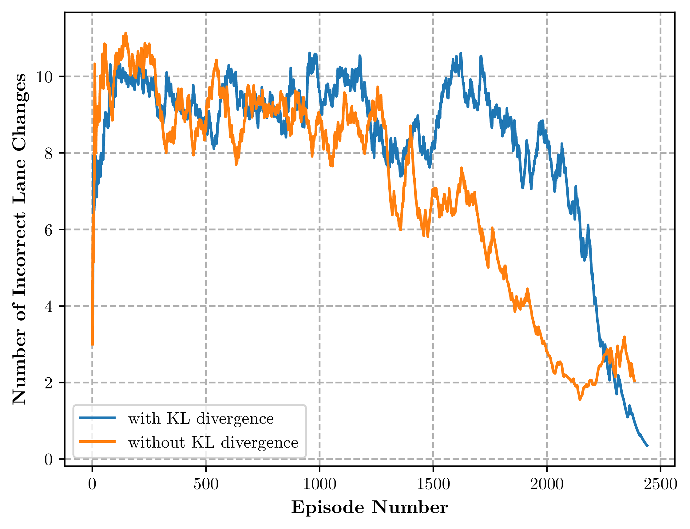

Generates publication quality plots, supporting LaTeX styles, characters etc.
Example plots are included.

Make sure pdflatex is installed on your system.

Saves plots in PGF format.
PGF allows for scalable figures as it is in vector form.

An example plot is included below:

To include in LaTeX:

    \begin{figure}
        \begin{center}
            \input{histogram.pgf}
        \end{center}
        \caption{A PGF histogram from \texttt{matplotlib}.}
    \end{figure}

Adjust plot size:

    \usepackage{layouts}

    [...]

    \printinunitsof{in}\prntlen{\textwidth}

Then, adjust the matplotlib figure accordingly:

`fig.set_size_inches(w=4.7747, h=3.5)`

Try `\usepackage{pgfplots}` or `\usepackage{pgf}` to use the *pgf* package.

